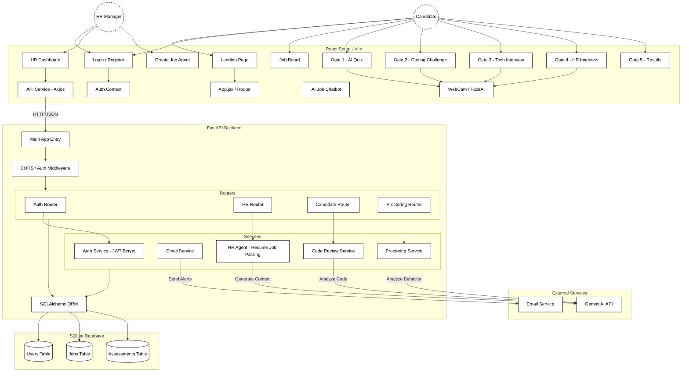
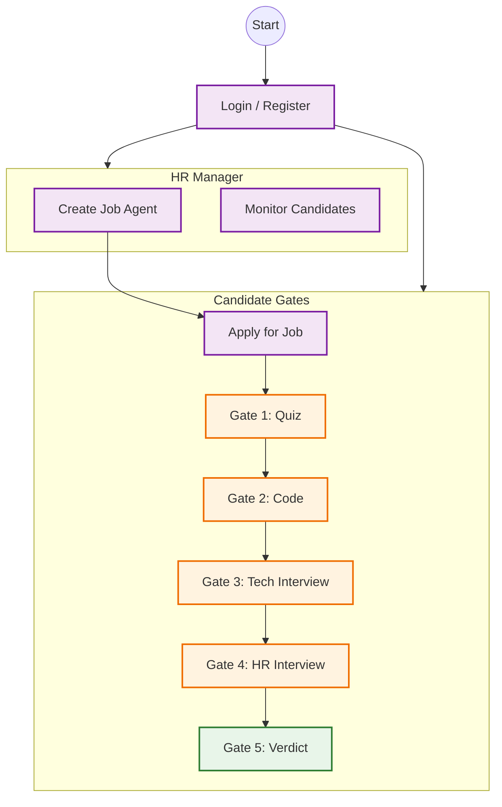

<div align="center">

# 🧠 HireLens Agent
### The Future of Automated Recruitment

[](https://reactjs.org/)
[](https://fastapi.tiangolo.com/)
[](https://www.sqlite.org/)
[](https://deepmind.google/technologies/gemini/)

_An intelligent, end-to-end recruitment platform that automates sourcing, screening, and interviewing using advanced AI Agents._

[View Demo](#) · [Report Bug](#) · [Request Feature](#)

</div>

---

## 📖 Table of Contents
- [Overview](#-overview)
- [Key Features](#-key-features)
- [System Architecture](#-system-architecture)
- [Workflow Diagram](#-workflow-diagram)
- [Project Structure](#-project-structure)
- [Getting Started](#-getting-started)
- [Tech Stack](#-tech-stack)

---

## 🚀 Overview
**HireLens Agent** revolutionizes the traditional hiring process by replacing manual screening with a sophisticated pipeline of AI-driven "Gates". Applications are automatically processed through aptitute tests, coding challenges, and conversational AI interviews.

### The 5-Gate System:
1.  **Gate 1 (Aptitude):** AI-proctored logic & reasoning quiz.
2.  **Gate 2 (Technical):** Live coding environment with Monaco Editor.
3.  **Gate 3 (Tech Interview):** Voice-based technical deep-dive.
4.  **Gate 4 (HR Interview):** Behavioral assessment with "Sarah" (AI Persona).
5.  **Gate 5 (Verdict):** Comprehensive report & hiring recommendation.

---

## ✨ Key Features
- **🤖 Autonomous Hiring Agents:** AI parsers can create Jobs from a single description.
- **👁️ AI Proctoring:** Real-time face detection and tab-switch monitoring to ensure integrity.
- **🗣️ Natural Voice Conversastions:** Fluid speech-to-text and text-to-speech interviews.
- **📊 HR Dashboard:** Detailed analytics, candidate status tracking, and "My Agents" management.
- **🎨 Premium UI:** Glassmorphism design, 3D tilt effects, and smooth Framer Motion animations.

---

## 🏗 System Architecture

The platform is built on a decoupled architecture with a React Frontend and FastAPI Backend, communicating via RESTful APIs.



---

## 🔄 Workflow Diagram

### Candidate & HR Journey
A streamlined process from Job Creation to Final Offer.



---

## 📂 Project Structure

<details>
<summary>Click to view detailed file structure</summary>

```bash
HireLens-Agent/
├── backend/                  # FastAPI Backend
│   ├── app/
│   │   ├── core/             # Config & Database
│   │   ├── models/           # SQLAlchemy Models
│   │   ├── routers/          # API Routes (Auth, HR, Candidate)
│   │   ├── schemas/          # Pydantic Models
│   │   └── services/         # Business Logic (AI, Email, Proctoring)
│   ├── hirelens_v2.db        # SQLite Database
│   └── requirements.txt      # Python Dependencies
│
├── frontend/                 # React Frontend
│   ├── src/
│   │   ├── components/       # Reusable UI Components
│   │   ├── context/          # Auth Context
│   │   ├── pages/            # Page Views
│   │   │   ├── Auth/         # Login/Register
│   │   │   ├── Candidate/    # Gates 1-5 & Job Board
│   │   │   └── HR/           # Dashboard & Job Creation
│   │   └── services/         # API Integration
│   ├── tailwind.config.js    # Styling Config
│   └── vite.config.js        # Build Config
│
├── SYSTEM_ARCHITECTURE.md    # Detailed Architecture Doc
├── WORKFLOW_DIAGRAM.md       # Detailed Workflow Doc
└── README.md                 # Project Documentation
```
</details>

---

## ⚡ Getting Started

### Prerequisites
- Node.js (v18+)
- Python (v3.10+)

### 1. Backend Setup
```bash
cd backend
pip install -r requirements.txt
python -m uvicorn app.main:app --reload
```

### 2. Frontend Setup
```bash
cd frontend
npm install
npm run dev
```

### 3. Access
- **Frontend:** `http://localhost:5173`
- **Backend API:** `http://localhost:8000/docs`

---

## 🛠 Tech Stack
- **Frontend:** React, Vite, Tailwind CSS, Framer Motion, Lucide Icons
- **Backend:** FastAPI, SQLAlchemy, Pydantic, Python-Multipart
- **AI/ML:** Google Gemini Pro, Face-API.js, Web Speech API
- **Database:** SQLite (Dev) / PostgreSQL (Prod ready)

---

<div align="center">
  <sub>Built with ❤️ by the HireLens Team</sub>
</div>
