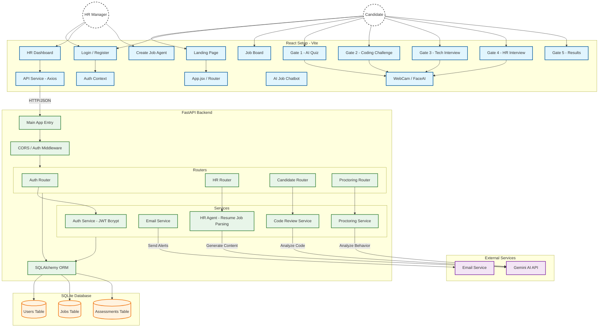

# System Architecture

## Overview
HireLens Agent is a comprehensive AI-powered recruitment platform designed to automate the hiring process through a series of intelligent "Gates".

### High-Level Block Diagram

## Component Details

### Frontend (React)
- **Gate 1 (Quiz)**: Timed multiple-choice questions with AI proctoring.
- **Gate 2 (Coding)**: Integrated Monaco Editor, code execution, and tab-switch detection.
- **Gate 3 (Tech Interview)**: Voice-enabled AI interview focusing on technical depth.
- **Gate 4 (HR Interview)**: Behavioral interview with "Sarah" (AI Persona) and sentiment analysis.
- **Proctoring**: continuous face detection via `face-api.js` and focus tracking.

### Backend (FastAPI)
- **Auth**: JWT-based authentication with role-based access control (Candidate vs. HR).
- **HR Router**: Handles job creation, resume parsing, and candidate management.
- **Candidate Router**: Manages the application workflow (Gates 1-5) and submissions.
- **Proctoring Router**: Receives violation alerts and logs suspicious activity.

### External Integration
- **Gemini AI**: Powers the intelligent aspects, including:
    - Parsing job descriptions.
    - Generating quiz questions.
    - Reviewing code submissions.
    - Conducting conversational interviews (Persona).
- **SMTP**: Sends invites and proctoring violation alerts.
