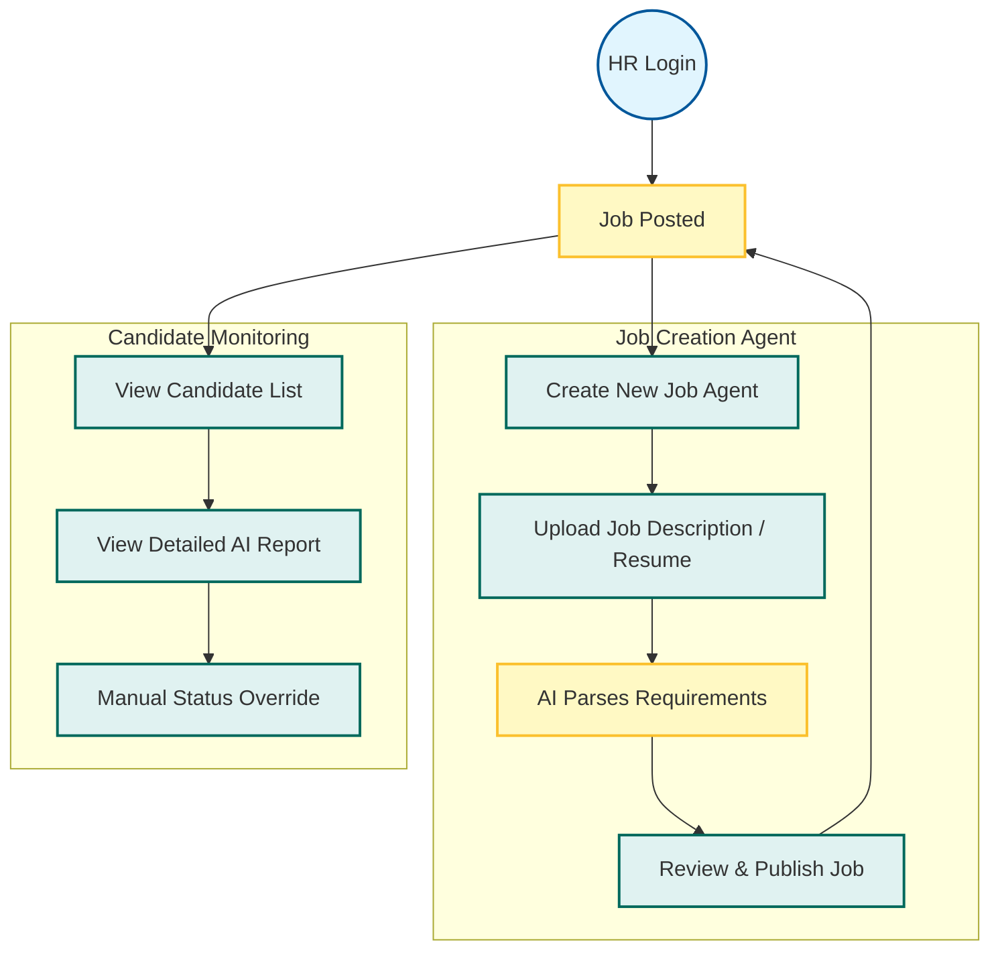

# HireLens Agent - Workflow Diagram

## 1. Candidate Journey (The 5 Gates)

This flow illustrates the automated screening process a candidate goes through.

```mermaid
graph TD
    %% Styles
    classDef start fill:#e1f5fe,stroke:#01579b,stroke-width:2px;
    classDef process fill:#f3e5f5,stroke:#7b1fa2,stroke-width:2px;
    classDef gate fill:#fff3e0,stroke:#ef6c00,stroke-width:2px;
    classDef decision fill:#e8f5e9,stroke:#2e7d32,stroke-width:2px;
    classDef endstate fill:#ffebee,stroke:#c62828,stroke-width:2px;

    Start((Start)):::start
    Login[Login / Register]:::process
    JobBoard[Browse Job Board]:::process
    Apply[Apply for Job]:::process

    %% Gate 1
    subgraph Gate_1 [Gate 1: Aptitude & Logic]
        G1_Start[Start Quiz]:::gate
        G1_Proctor[AI Proctoring Active]:::process
        G1_Submit[Submit Answers]:::process
        G1_Check{Score > 70%?}:::decision
    end

    %% Gate 2
    subgraph Gate_2 [Gate 2: Coding Challenge]
        G2_Start[Start Coding]:::gate
        G2_Env[Monaco Editor + Exec]:::process
        G2_Check{All Test Cases Pass?}:::decision
    end

    %% Gate 3
    subgraph Gate_3 [Gate 3: AI Technical Interview]
        G3_Start[Voice Interview]:::gate
        G3_AI[AI Asks Technical Qs]:::process
        G3_Reply[Candidate Responds (Speech)]:::process
        G3_Analyze[Analyze Technical Depth]:::process
    end

    %% Gate 4
    subgraph Gate_4 [Gate 4: AI HR Interview]
        G4_Start[Behavioral Interview]:::gate
        G4_Persona["Sarah" (AI Persona)]:::process
        G4_Sentiment[Analyze Sentiment & Confidence]:::process
    end

    %% Gate 5
    subgraph Gate_5 [Gate 5: Final Verdict]
        Results[Generate Comprehensive Report]:::process
        Final_Decision{Hire Recommendation}:::decision
    end

    %% Flow Connections
    Start --> Login --> JobBoard --> Apply --> G1_Start
    G1_Start --> G1_Proctor --> G1_Submit --> G1_Check
    
    G1_Check -- No --> Reject[Application Rejected]:::endstate
    G1_Check -- Yes --> G2_Start

    G2_Start --> G2_Env --> G2_Check
    G2_Check -- No --> Reject
    G2_Check -- Yes --> G3_Start

    G3_Start --> G3_AI --> G3_Reply --> G3_Analyze --> G4_Start

    G4_Start --> G4_Persona --> G4_Sentiment --> Results
    Results --> Final_Decision

    Final_Decision -- High Score --> Offer[Shortlisted for Offer]:::decision
    Final_Decision -- Low Score --> Reject

```

## 2. HR Manager Workflow

This flow shows how HR Managers create jobs and monitor candidates.


