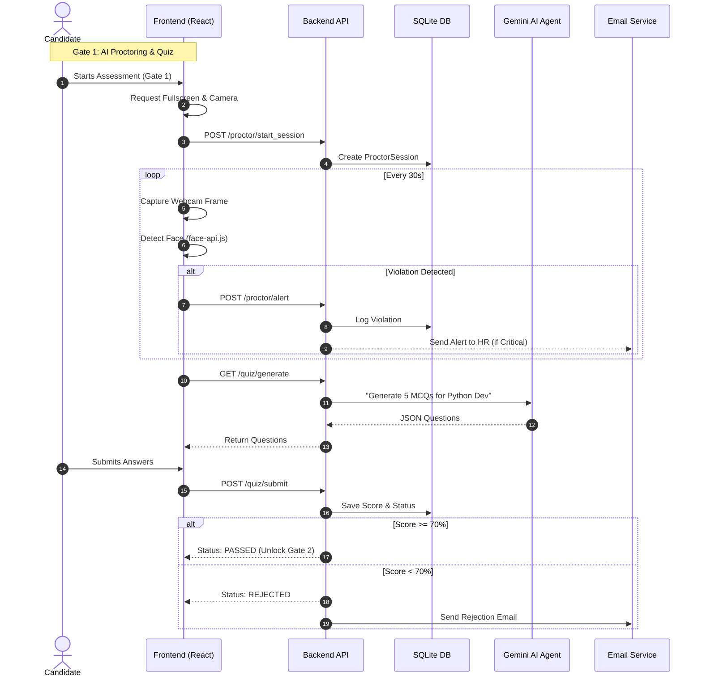
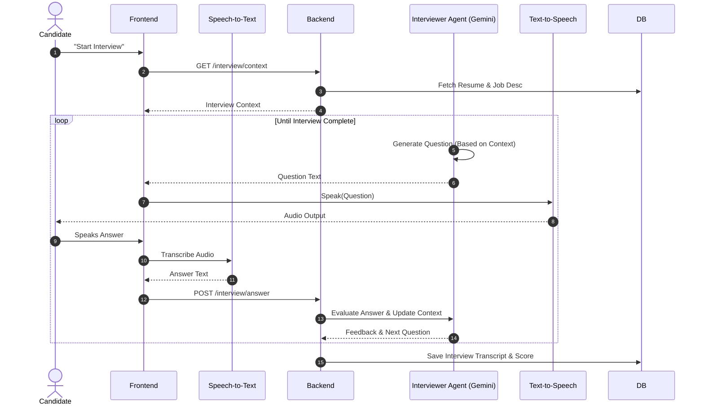
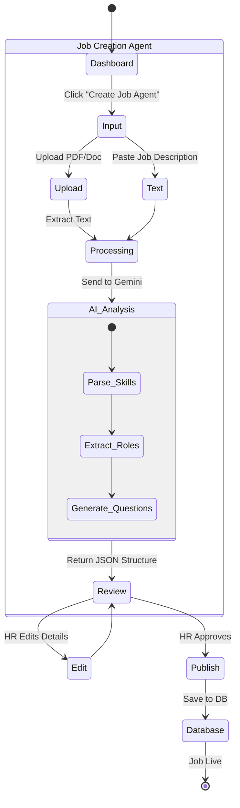

# HireLens Agent - Advanced Workflows

## 1. Candidate Assessment Lifecycle (Sequence Diagram)
This detailed sequence shows the technical interaction during a typical Interview Gate.

## 2. AI Technical Interview Flow (Gate 3)
Details the Voice-to-Voice AI interaction.

## 3. Job Creation Agent (HR Workflow)
How the HR Agent parses raw text into a structured Job Posting.

